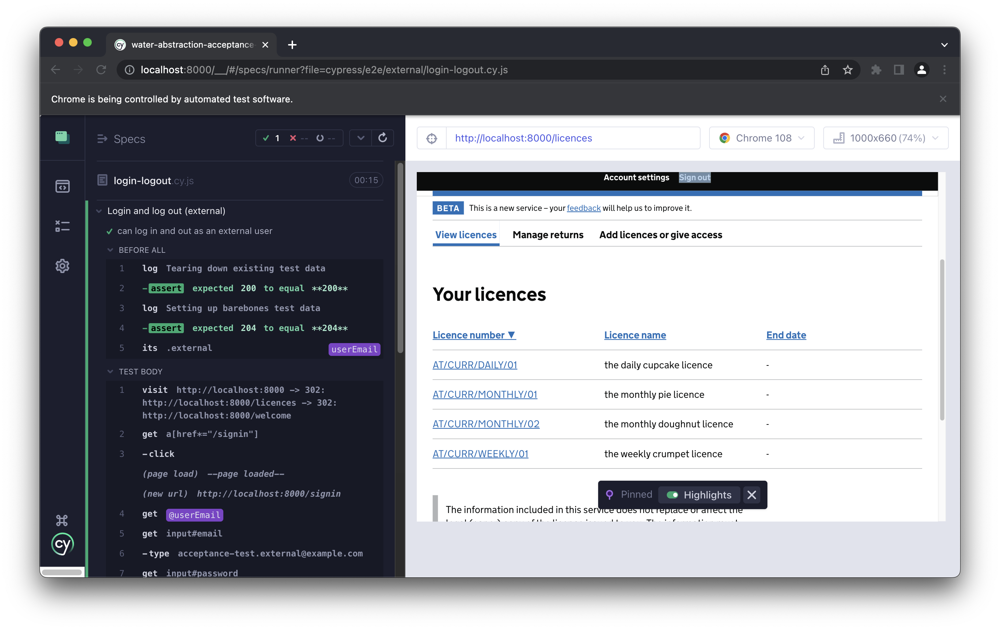
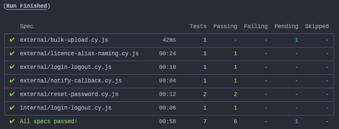
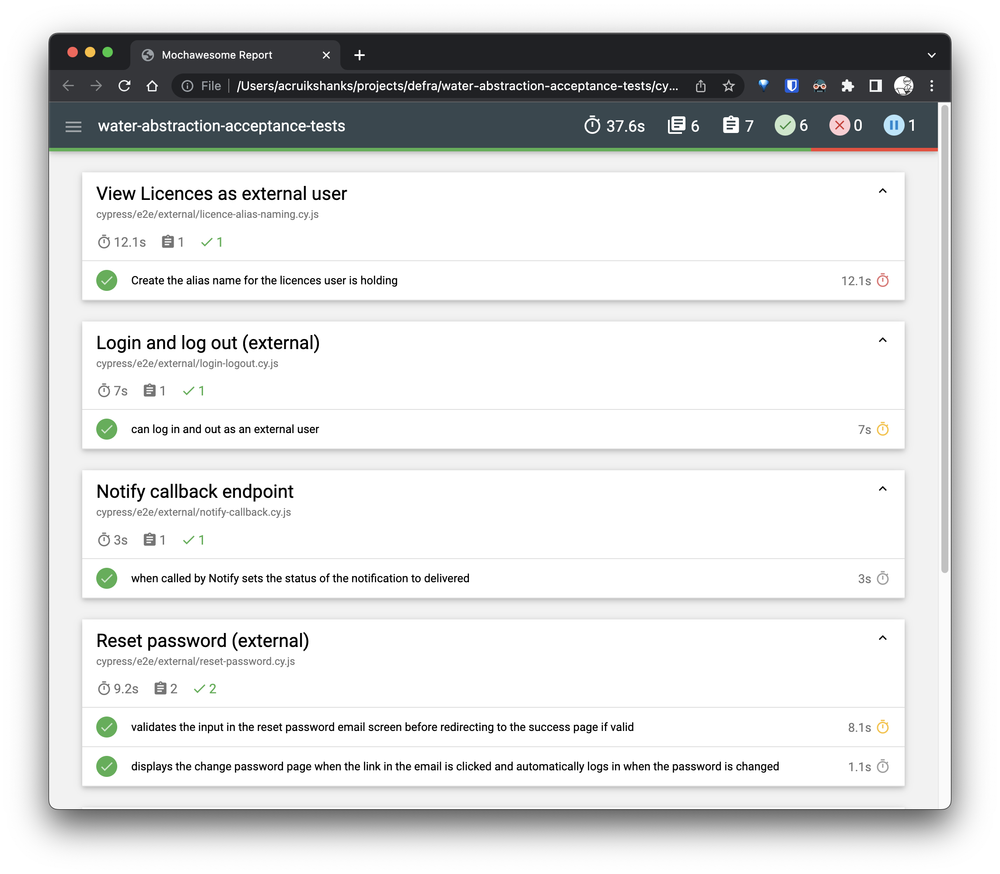

# Water Abstraction acceptance tests

> WIP: We are still in the process of migrating our existing tests from the [water-abstraction-ui](https://github.com/DEFRA/water-abstraction-ui). It uses Cypress v8 and does not have test isolation. It therefore is not a simple copy & paste exercise.

These acceptance tests support the [Manage your water abstraction or impoundment licence service](https://manage-water-abstraction-impoundment-licence.service.gov.uk/) and it's internal counterpart.

They are maintained by the [Water Abstraction Team](https://github.com/DEFRA/water-abstraction-team).

## Pre-requisites

You just need [Node.js](https://nodejs.org/en/) installed, ideally an LTS version and no less than v16.

You'll also need [Chrome](https://www.google.com/intl/en_uk/chrome/). It's what we use when working on the tests, and is one of 2 browsers available to our internal users.

## Installation

First clone the repository and then drop into your new local repo

```bash
git clone https://github.com/DEFRA/water-abstraction-acceptance-tests.git && cd water-abstraction-acceptance-tests
```

Next download and install the dependencies

```bash
npm ci
```

## Configuration

> Important! Do not add environment files to source control

We have 4 environments the tests can run against; local, development, test, and pre-production.

Each has its own [JSON](https://www.json.org/json-en.html) config file stored in `environments/`.

### Environment files

The config or 'environment' files hold environment variables which are key-value pairs; _name of the thing_ and the _value of the thing_. For example, `"defaultPassword": "P@55word"`. These are grouped by `config` and `values`.

- `config` is used to configure Cypress itself
- `values` are used within the tests and accessible via [Cypress.env()](https://docs.cypress.io/api/cypress-api/env)

You tell Cypress which environment to use by which [npm run script](https://docs.npmjs.com/cli/v9/commands/npm-run-script) you launch from [package.json](/package.json), for example `npm run cy:open:tst`.

Using these `*.json` files allows us to store both config and credentials that change across environments in one place but it is important they are _**never**_ committed to source control.

Checkout [environments/example.json](/environments/example.json) for an example of the file you'll need to create for each environment.

## Execution

You can run tests using the Cypress test runner or headless using the Cypress CLI.

### Test runner

> Cypress runs tests in a unique interactive runner that allows you to see commands as they execute while also viewing the application under test.



To open the test runner use `npm run cy:open:[env]` replacing `[env]` with your chosen environment

```bash
npm run cy:open:tst
```

### CLI

> Runs Cypress tests to completion. By default, it will run all tests headless in the Electron browser.



To open the CLI use `npm run cy:run:[env]` replacing `[env]` with your chosen environment

```bash
npm run cy:run:tst
```

## Reporting

When Cypress is [run](https://docs.cypress.io/guides/guides/command-line#cypress-run), for example `npm run cy:run:tst`, a HTML report of the results is automatically generated.



## VSCode tasks

Currently, the whole team uses [VSCode](https://code.visualstudio.com/) when working on the service. So, we like to add custom [tasks](https://code.visualstudio.com/docs/editor/tasks) to our repos, both to make our lives easier and as a way of documenting some of the things you can do.

You access the tasks using the [Command palette](https://code.visualstudio.com/docs/getstarted/userinterface#_command-palette) (⇧⌘P). With the palette open search for **Run test task** and once highlighted select it. You'll then be shown a list of helper tasks, for example.

- **📺 Open (Tests)**
- **📻 Run (Tests)**
- **📋 Report (Tests)**

Feel free to check them out! 😁

## Contributing to this project

If you have an idea you'd like to contribute please log an issue.

All contributions should be submitted via a pull request.

## Licence

THIS INFORMATION IS LICENSED UNDER THE CONDITIONS OF THE OPEN GOVERNMENT LICENCE found at:

<http://www.nationalarchives.gov.uk/doc/open-government-licence/version/3>

The following attribution statement MUST be cited in your products and applications when using this information.

> Contains public sector information licensed under the Open Government licence v3

### About the licence

The Open Government Licence (OGL) was developed by the Controller of Her Majesty's Stationery Office (HMSO) to enable information providers in the public sector to license the use and re-use of their information under a common open licence.

It is designed to encourage use and re-use of information freely and flexibly, with only a few conditions.
