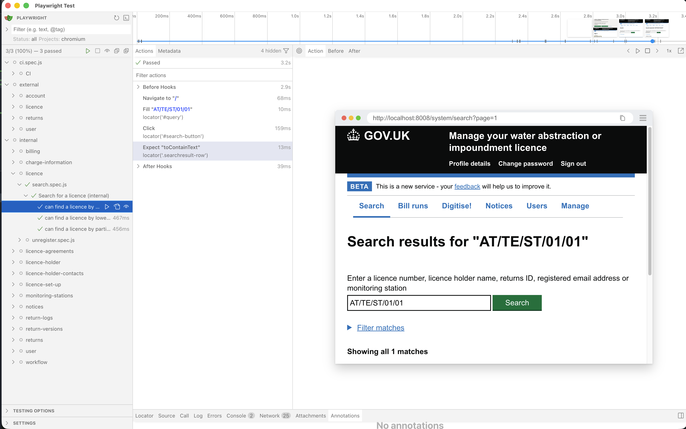
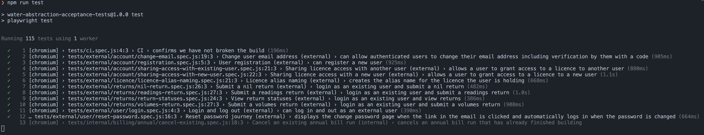
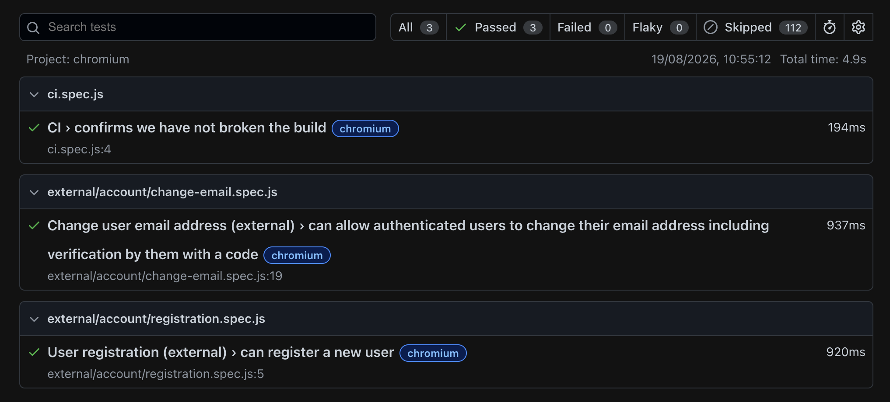

# Water Abstraction acceptance tests


[](https://github.com/DEFRA/water-abstraction-acceptance-tests/actions/workflows/shai-hulud-detect.yml)
[](http://www.nationalarchives.gov.uk/doc/open-government-licence/version/3)

> This project originated with the migration of existing tests from the [water-abstraction-ui](https://github.com/DEFRA/water-abstraction-ui). It used Cypress v8 and did not have test isolation so all had to be restructured. The quality of these tests is not great but it's been our aim to review and improve all tests over time.
>
> We believe we've achieved this with the rewrite to Playwright. We've rebuilt all of the data and scenarios, and improved the tests where possible.

These acceptance tests support the [Manage your water abstraction or impoundment licence service](https://manage-water-abstraction-impoundment-licence.service.gov.uk/) and it's internal counterpart.

They are maintained by the [Water Abstraction Team](https://github.com/DEFRA/water-abstraction-team).

## Pre-requisites

You just need [Node.js](https://nodejs.org/en/) installed, ideally an LTS version and no less than v22.

You'll also need [Chrome](https://www.google.com/intl/en_uk/chrome/). It's what we use when working on the tests, and is one of 2 browsers available to our internal users.

## Installation

First clone the repository and then drop into your new local repo

```bash
git clone https://github.com/DEFRA/water-abstraction-acceptance-tests.git && cd water-abstraction-acceptance-tests
```

Next download and install the dependencies

```bash
npm ci
```

## Configuration

> Important! Do not add your `.env` file to source control

The tests run against your local instance of the service, so most configuration (base URLs, the default test password) is fixed in [tests/config.js](/tests/config.js).

The only things that vary are a couple of secrets the tests need but which shouldn't be committed: a JWT token and the Notify callback token. These are read from environment variables loaded from a `.env` file at the root of the project using [dotenv](https://www.npmjs.com/package/dotenv).

Copy [.env.example](/.env.example) to `.env` and fill in the values. `.env` is gitignored, so it's safe to keep your real credentials in it.

## Execution

You can run tests using the Playwright UI mode or headless from the CLI.

### Test runner

> Playwright's UI mode runs tests in a unique interactive runner that allows you to see commands as they execute while also viewing the application under test.



To open the test runner use

```bash
npm run open
```

### Headless

> Runs Playwright tests to completion, headless, in Chromium.



To run the tests from the CLI use

```bash
npm test
```

## Test data

When building [water-abstraction-system](https://github.com/DEFRA/water-abstraction-system) we found there were numerous times we needed certain data to exist in the DB for our integration tests. To support this we built a series of test helpers that can quickly add test data to a DB, populated with what is needed for the service to 'work', or overridden with what is needed for a test.

The same applies to our acceptance tests. You can't generate a bill run, if you haven't licences with charging information to base the bill run on!

We created an API endpoint in **water-abstraction-system** that allows us to 'seed' data for our acceptance tests, making use of the test helpers. We also created a 'tear down' endpoint that will delete any test data, so the service can be 'refreshed' between tests.

We've made every effort to make our scenarios and data as realistic as possible. Where one piece of data can't exist without another, we compose them together as an 'entity' — for example, a licence isn't valid without a licence holder, so `licence.entity.js` builds both together.

We also allow scenarios to 'extend' from a previous scenario, reducing the duplication of some of the more complex scenarios.

Most of our acceptance tests will start with two steps

- Tearing down any existing test data
- Generating then loading the test data via a 'scenario' for the test being run

## Reporting

When Playwright is [run](https://playwright.dev/docs/running-tests) headless, for example `npm run run`, an HTML report of the results is automatically generated. Open it with

```bash
npm run report
```



## CLI

> Only one CLI function currently exists, but we'll add more in the future!

We provide a CLI for other functionality that can be accessed using `npm run cli`.

### seed

We realised our scenarios can be really useful when working on new features and for manual and exploratory testing. This was to the extent that some team members would comment out the 'assert' part of a test in order to just load the scenario.

To better support this we created the **seed cli**. It will list the scenarios we have by file name, and when selected, will first run tear down, then load the scenario's test data

## VSCode tasks

Currently, the whole team uses [VSCode](https://code.visualstudio.com/) when working on the service. So, we like to add custom [tasks](https://code.visualstudio.com/docs/editor/tasks) to our repos, both to make our lives easier and as a way of documenting some of the things you can do.

You access the tasks using the [Command palette](https://code.visualstudio.com/docs/getstarted/userinterface#_command-palette) (⇧⌘P). With the palette open search for **Run test task** and once highlighted select it. You'll then be shown a list of helper tasks, for example.

- **📺 Open (Tests)**
- **📻 Run (Tests)**
- **📋 Report (Tests)**
- **🌱 Seed (Tests)**

Feel free to check them out! 😁

## Contributing to this project

If you have an idea you'd like to contribute please log an issue.

All contributions should be submitted via a pull request.

## Licence

THIS INFORMATION IS LICENSED UNDER THE CONDITIONS OF THE OPEN GOVERNMENT LICENCE found at:

<http://www.nationalarchives.gov.uk/doc/open-government-licence/version/3>

The following attribution statement MUST be cited in your products and applications when using this information.

> Contains public sector information licensed under the Open Government licence v3

### About the licence

The Open Government Licence (OGL) was developed by the Controller of Her Majesty's Stationery Office (HMSO) to enable information providers in the public sector to license the use and re-use of their information under a common open licence.

It is designed to encourage use and re-use of information freely and flexibly, with only a few conditions.
